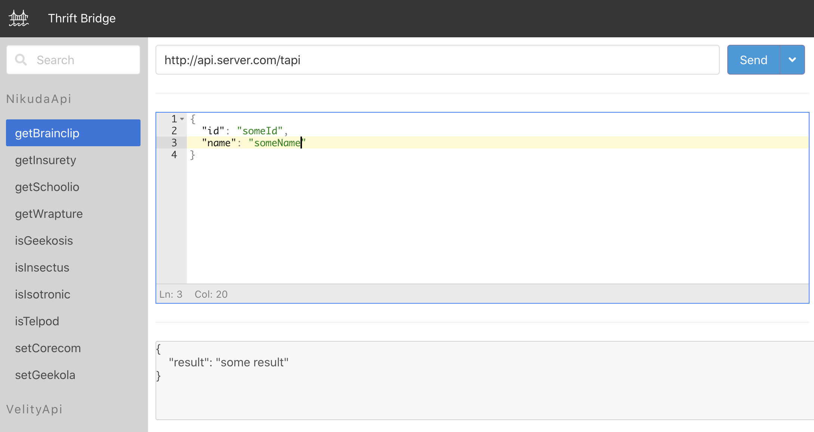

# Thrift-Rest Bridge UI

[](https://sonarcloud.io/dashboard?id=artemy-osipov_thrift-rest-bridge-ui)
[](https://sonarcloud.io/dashboard?id=artemy-osipov_thrift-rest-bridge-ui)

UI for [REST API](https://github.com/artemy-osipov/thrift-rest-bridge)

## Usage

Run UI via docker

```bash
export API_URL=http://bridge.server.com # url to bridge rest api
export BASE_HREF=/thrift-rest-bridge-ui # base url
docker run --rm -p 80:80 -e API_URL -e BASE_HREF ir2sora/thrift-rest-bridge-ui:0.1.0
```

App will be accessible on `http://localhost:80/thrift-rest-bridge-ui`


